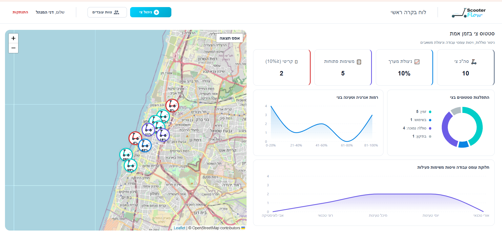
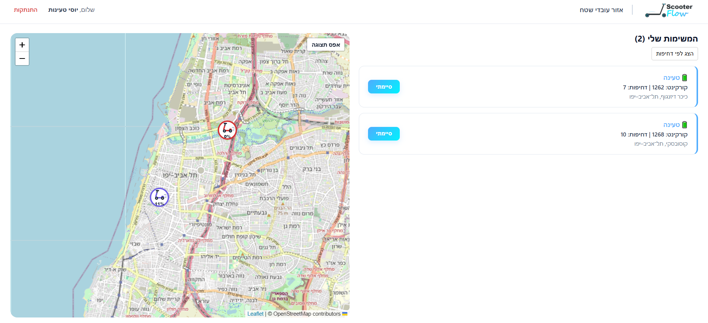

🛴 ScooterFlow Management System

פותח ע"י נועה גבאי

מערכת ניהול חכמה לתפעול ותחזוקת ציי קורקינטים שיתופיים. ScooterFlow היא פלטפורמת ניהול מרכזית המאפשרת לארגונים לנהל את צי הקורקינטים שלהם בזמן אמת. המערכת מחברת בין מנהלי תפעול לבין עובדי שטח, ומבטיחה תהליכי טעינה ותיקון יעילים ומהירים — באמצעות אוטומציה מלאה של זיהוי תקלות, שיוך משימות וניטור סוללה.

📸 תצוגת המערכת

להלן צילומי מסך המציגים את היכולות של המערכת:

מרכז הבקרה (Dashboard)

ממשק עובדי השטח

🛠️ טכנולוגיות מרכזיות

Frontend

React.js — ספריית הליבה לבניית הממשק
Material UI (MUI) — קומפוננטות עיצוב מקצועיות
Leaflet.js — מפות אינטראקטיביות מבוססות OpenStreetMap
Redux Toolkit (RTK Query) — ניהול state ותקשורת מול השרת עם cache חכם
React Router DOM — ניתוב ושמירת הרשאות לפי תפקיד

Backend

Java 17 + Spring Boot 3 — שרת ה-API
Spring Security + JWT — אימות והרשאות מבוססות תפקיד
JPA / Hibernate — שכבת גישה למסד הנתונים
MySQL — מסד הנתונים הראשי
Spring Scheduled Tasks — מנגנון אוטומציה וסימולציה הרץ ברקע

API Integration

עבודה מול שירותי צד ג' (OpenStreetMap / Nominatim) לעיבוד נתונים גיאוגרפיים והצגת כתובות בזמן אמת

🚀 יכולות המערכת

מרכז בקרה למנהלים

ניהול צוות עובדים — הוספה, עריכה, מחיקה והגדרת הרשאות לפי תפקיד
ניהול צי קורקינטים — CRUD מלא על סטטוס, מיקום ורמת סוללה
תצוגה בזמן אמת — צפייה בכל הקורקינטים על גבי מפה אינטראקטיבית, מתעדכנת אוטומטית
לוח KPIs — סה"כ צי, ניצולת, משימות פתוחות וכלים במצב קריטי
גרפים חזותיים — התפלגות סטטוסים, רמות סוללה ועומס עבודה לפי עובד

אזור עובדי שטח

תעדוף משימות — ניהול משימות טעינה ותיקון חכם לפי דחיפות
ניווט מהיר — מיקוד משימה על המפה בלחיצת כפתור
חיווי ויזואלי — ניטור מצב סוללה וסטטוס תקינות בזמן אמת
סיום משימה במגע אחד — עדכון מיידי של סטטוס הקורקינט במערכת

ממשק חווייתי (UX/UI)

עיצוב מודרני, נקי ורספונסיבי המותאם לעבודה אינטנסיבית בשטח
תמיכה מלאה בכיווניות RTL
שימוש ב-Modals מקצועיים ומשוב חיובי (Success states) לכל פעולה

אוטומציה חכמה (Backend)

סימולציית פעילות — פריקת סוללה ותנועת קורקינטים בזמן אמת
יצירת משימות אוטומטית — זיהוי קורקינטים הזקוקים לטעינה, תיקון או הזזה
שיוך משימות חכם — חלוקת עומסים אוטומטית לעובד הפנוי ביותר בתפקיד הרלוונטי

💡 למה המערכת הזו?

המערכת פותחה תוך מחשבה על חוויית משתמש (UX) מותאמת אישית:

ביצועים — שימוש ב-RTK Query מבטיח עבודה מהירה ללא זמני טעינה מיותרים, עם cache חכם וסנכרון אוטומטי בין מסכים
אמינות — ניהול נתונים מבוסס אחסון מקומי המבטיח אבטחה בסיסית וניקוי נתונים אוטומטי ביציאה, יחד עם הרשאות JWT בצד השרת
פשטות — ממשק אינטואיטיבי המאפשר לעובדי שטח להבין את סדר העדיפויות שלהם תוך שניות
סקיילביליות — ארכיטקטורת Client-Server מלאה עם הפרדה ברורה בין שכבות, המאפשרת הרחבה עתידית בקלות

🚀 הוראות הרצה (Installation)

כדי להריץ את הפרויקט על המחשב המקומי, בצעו את השלבים הבאים:

דרישות מקדימות

Java 17+
Node.js 18+
MySQL 8+

1. שכפול הפרויקט (Clone)

bashgit clone https://github.com/noag100/ScooterFlow.git
cd ScooterFlow

2. הרצת השרת (Backend)

bash# יצירת מסד הנתונים
mysql -u root -p -e "CREATE DATABASE scooterflow;"

# עדכון application.properties עם פרטי החיבור שלך, ואז:
cd server
./mvnw spring-boot:run

השרת ירוץ על http://localhost:8080

⚠️ יש להוסיף ידנית עובד ראשון עם role = ADMIN ישירות במסד הנתונים כדי להתחבר בפעם הראשונה.

3. הרצת הלקוח (Frontend)

bashcd client
npm install
npm run dev

האפליקציה תרוץ על http://localhost:5173

📁 מבנה הפרויקט

ScooterFlow/
├── client/                     # React frontend
│   └── src/
│       ├── API/                # RTK Query: BaseApi, ScooterApi, TaskApi, WorkerApi
│       ├── components/
│       │   ├── Login/
│       │   ├── Dashboard/      # MapPage.jsx — לוח הבקרה
│       │   ├── Management/     # ScooterManagement.jsx, WorkerManagement.jsx
│       │   ├── WorkerTasks/    # WorkerTasks.jsx
│       │   └── Map/            # Map.jsx — רכיב Leaflet
│       ├── store/               # Redux store
│       └── App.js               # Routing + ניהול הרשאות
└── server/                     # Spring Boot backend
    └── src/main/java/com/example/scooterflow/
        ├── controller/          # ScooterController, TaskController, WorkerController
        ├── service/             # ScooterService, TaskService, WorkerService,
        │                        # SimulationService, TaskAutomationService
        ├── repositories/        # ScooterRep, TaskRep, WorkerRep
        ├── entities/            # Scooter, Task, Worker
        ├── security/            # JwtUtils, JwtAuthenticationFilter
        └── config/              # SecurityConfig

🔌 תיעוד API

Auth

MethodEndpointתיאורPOST/api/workers/loginהתחברות — מחזיר JWT ופרטי משתמש

Scooters

MethodEndpointתיאורGET/api/scootersשליפת כל הקורקינטיםPOST/api/scootersהוספת קורקינט חדשPUT/api/scooters/{id}עדכון קורקינטDELETE/api/scooters/{id}מחיקת קורקינטGET/api/scooters/statsסטטיסטיקות ללוח הבקרהGET/api/scooters/worker/{workerId}קורקינטים הרלוונטיים לעובד

Tasks

MethodEndpointתיאורGET/api/tasksשליפת כל המשימותGET/api/tasks/worker/{workerId}משימות פעילות של עובדPOST/api/tasks/{taskId}/completeסיום משימהPOST/api/tasks/report-damage/{scooterId}דיווח תקלה

Workers

MethodEndpointתיאורGET/api/workersשליפת כל העובדיםPOST/api/workersהוספת עובד (ADMIN בלבד)PUT/api/workers/{id}עדכון עובד (ADMIN בלבד)DELETE/api/workers/{id}מחיקת עובד (ADMIN בלבד)PATCH/api/workers/{id}/availabilityשינוי זמינות עובד

⚙️ אוטומציה ברקע

תהליךתדירותתיאורsimulateBatteryDrainכל 10 שניותפריקת סוללה ותנועת קורקינטים בנסיעהrunAutoTaskGenerationכל 15 שניותיצירת משימות טעינה / תיקון / הזזה אוטומטיתsimulateRandomBreakdownכל דקהסימולציית תקלה אקראית בקורקינטrunAutomationCycleכל דקהשיוך משימות פתוחות לעובדים זמינים

⚠️ הערות לפני העברה לסביבת Production

הסיסמאות נשמרות כיום כ-Plain Text — מומלץ לשדרג להצפנת BCrypt
ה-JWT Secret מוגדר כרגע בקוד — יש להעביר ל-environment variable
הגדרות CORS מוגבלות כיום ל-http://localhost:5173 בלבד

👩‍💻 קרדיט

פותח על ידי נועה גבאי.

📄 רישיון

פרויקט פרטי / לימודי.
